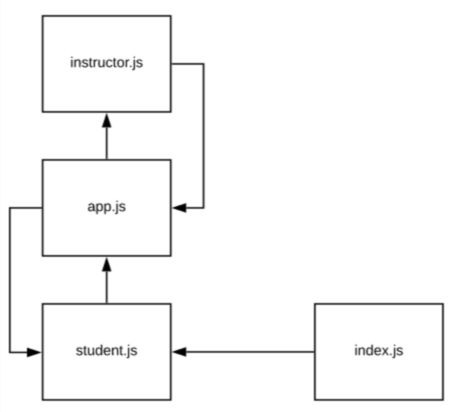

# Apprenti-401-Lab-18
## Websockets and Socket.io

### Author: Lindsay Peltier

### Links and Resources
* [submission PR](https://github.com/LindsayPeltier-401-advanced-javascript/Apprenti-401-Lab-18/pull/1)
* [travis](https://www.travis-ci.com/LindsayPeltier-401-advanced-javascript/Apprenti-401-Lab-18)

#### Documentation
* [jsdoc](.docs/index.html)

### Setup
#### `.env` requirements
* `PORT` - 3000

#### Running the app
* server.js: nodemon server.js
* student.js: nodemon student.js 
* instructor.js: nodemon instructor.js

**To start intervals of assignments being graded**
* app.js: nodemon app.js
  
#### Tests
* `npm test`

#### UML
